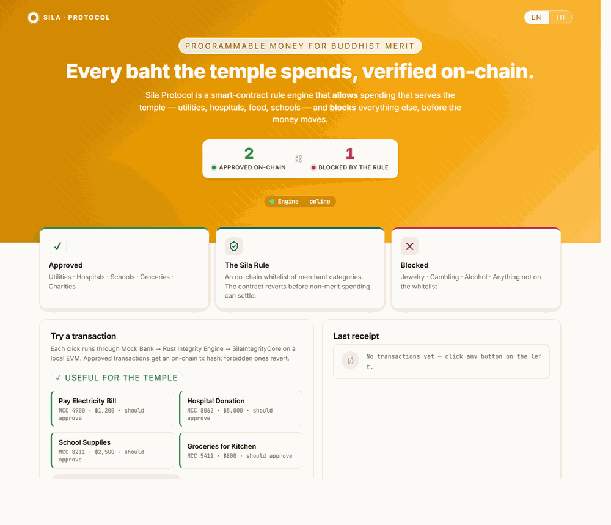

# Sila Protocol — Temple Transparency POC

[](https://codespaces.new/Anon5th/Sila?quickstart=1)

> Programmable money for Buddhist merit. A blockchain integrity layer for the
> 2026 Thai e-Donation mandate.

🇹🇭 [อ่านเอกสารนี้เป็นภาษาไทย](./README.th.md)



**👆 Click the badge above to launch the live demo in your browser — zero
install, ~3 minutes from click to working dashboard.** No Docker, no Git, no
toolchain on your machine. Free GitHub account is all you need.

Sila Protocol is a proof-of-concept that demonstrates how donations to Thai
temples can be transparently verified on-chain. Every expenditure flows through
a smart-contract rule engine that approves "merit" categories (utilities,
hospitals, education, food) and **reverts** non-merit categories (jewelry,
gambling, alcohol). The result is a tamper-evident receipt for every baht.

This repo is fully Dockerized — a reviewer can clone it and run the demo with
**one click**, and zero toolchain installs.

---

## 🚀 One-Click Demo (For Reviewers)

Three ways to run the demo. Pick whichever is easiest for you.

### Easiest — Open in Codespaces (no install at all)

[](https://codespaces.new/Anon5th/Sila?quickstart=1)

Click the badge above. GitHub will spin up a free cloud development
environment in your browser, build the demo, and open the dashboard in a
preview tab — **all you need is a free GitHub account and any browser**
(Chrome, Edge, Safari, Firefox). Works equally well on Windows, macOS, Linux,
even on a tablet.

### Run locally on your computer (Windows / macOS / Linux)

If you'd rather run on your own machine, install **Docker Desktop** first,
then double-click the launcher for your operating system:

| Platform                          | Action                                                                                                                     |
|-----------------------------------|----------------------------------------------------------------------------------------------------------------------------|
| **Windows 10 / 11**               | Double-click [`start-windows.bat`](./start-windows.bat).                                                                    |
| **macOS** (Intel + Apple Silicon) | Double-click [`start-mac.command`](./start-mac.command). *First time*: right-click → **Open** to bypass the Gatekeeper warning. |
| **Linux**                         | From a terminal: `./start-linux.sh` (run `chmod +x start-linux.sh` once if needed).                                        |

**What happens:**

1. The launcher starts Docker Desktop if it isn't running.
2. It builds and runs all four services (one-time build is 5–10 min; subsequent runs are seconds).
3. When the dashboard is healthy, your default browser opens at **http://localhost:3000**.
4. Press any key in the launcher window to **stop everything cleanly**.

> No data leaves your computer. The "bank", the blockchain, and the engine all
> run locally on your machine. There is no Internet call beyond pulling Docker
> images on first run.

**Don't have Docker Desktop?** Install it first:
[Windows / macOS](https://www.docker.com/products/docker-desktop/) ·
[Linux](https://docs.docker.com/engine/install/).

### What you'll see

1. A **header counter card** showing live counts of approved (green) and blocked
   (red) transactions — the green number reads directly from on-chain
   `approvedCount()` storage.
2. A **three-card feature strip**: ✓ Approved categories · 🛡 The Sila Rule ·
   ✕ Blocked categories.
3. **Two preset groups** of one-click transactions:
   - **Useful for the temple** (electricity, hospital, school supplies, groceries) — these will be approved.
   - **Forbidden by the rule** (Rolex, casino chips, bar tab) — these will be blocked.
4. A **last-receipt panel** with the on-chain tx hash (or revert reason) and a generated PromptPay QR code.
5. A **live ledger** below — newly added rows fade in.
6. An **EN / TH language toggle** in the top-right corner.

### What to try

- **Click "Pay Electricity Bill"** → green ✓ APPROVED, on-chain tx hash, block number. The header counter ticks up.
- **Click "Gold Rolex"** → red ✕ BLOCKED. Reason: `SILA_PROTOCOL: NON_MERIT_EXPENDITURE_DETECTED` — the contract reverted before any value moved.
- **Open the "Or send a custom transaction" form** and try MCC `5912` (drug stores) — it isn't on the whitelist, so it blocks. Then try `5411` (groceries) — approved.
- **Switch to TH** in the top-right — the entire UI re-renders in Thai (the contract still speaks English on the wire, by design).

### Headless verification

Once the launcher is up, you can also exercise the system from a terminal:

```bash
bash scripts/demo.sh
```

It runs four representative transactions and prints OK / MISMATCH for each.

### Troubleshooting

| Symptom                                                                | Fix                                                                                                                          |
|------------------------------------------------------------------------|------------------------------------------------------------------------------------------------------------------------------|
| Launcher closes instantly                                              | Run it from a terminal so you can see the error: `cmd /c start-windows.bat` or `./start-mac.command`.                        |
| **macOS:** "cannot be opened because it is from an unidentified developer" | Right-click `start-mac.command` → **Open** → **Open** (one-time bypass for unsigned scripts).                                |
| **Windows:** SmartScreen warns about the .bat                          | Click **More info** → **Run anyway** (one time per machine).                                                                  |
| Port 3000 is already in use                                            | Stop whatever is on it, or edit `docker-compose.yml` and change `"3000:3000"` to e.g. `"3030:3000"`, then rerun the launcher. |
| First-run build is slow                                                | Expected — Rust + Hardhat dependencies. Subsequent runs reuse the cached image and start in ~10 seconds.                     |
| Docker Desktop won't start (Windows: "stale Unix-socket reparse point") | Reboot Windows. If that doesn't fix it, **Docker Desktop → Troubleshoot → Reset to factory defaults**.                       |
| Engine logs `contract not found`                                       | The deployer didn't finish before the engine started. Run `docker compose down` and rerun the launcher.                      |

Exit codes from the launchers: `1` Docker missing · `2` daemon timeout · `3` build/health failure.

---

## One-command start (for developers)

If you have a terminal open already:

```bash
git clone <this repo>
cd "Sila Protocol"
docker compose up --build
```

Then open **http://localhost:3000**.

The first build takes a few minutes (Rust compile + npm install). Subsequent
runs are fast.

To stop:

```bash
docker compose down -v
```

---

## Architecture

```
            ┌─────────────────┐
   browser  │   Dashboard UI  │   localhost:3000
  ────────► │  (vanilla JS)   │
            └────────┬────────┘
                     │  POST /api/transaction
                     ▼
            ┌─────────────────┐
            │  Mock Bank API  │   Express + PromptPay QR
            │   (TypeScript)  │   :3000
            └────────┬────────┘
                     │  POST /verify  { mcc, amount, label }
                     ▼
            ┌─────────────────┐
            │ Integrity Engine│   Rust + Axum + Alloy
            │     (Rust)      │   :8080
            └────────┬────────┘
                     │  eth_call / eth_sendTransaction
                     ▼
            ┌─────────────────┐
            │ SilaIntegrityCore│  Solidity contract
            │   on Hardhat    │   :8545 (chainId 31337)
            └─────────────────┘
```

Four containers, orchestrated by `docker-compose.yml`:

| Service     | Role                                                     | Port |
|-------------|----------------------------------------------------------|------|
| `hardhat`   | Local EVM node                                           | 8545 |
| `deployer`  | One-shot — deploys the contract, writes ABI + address    | —    |
| `engine`    | Rust HTTP service that talks to the smart contract       | 8080 |
| `mock-bank` | Express service + dashboard UI                           | 3000 |

The deployer writes `/contract-out/sila.json` to a shared volume; the engine
reads it on startup. This decouples deploy timing from the engine binary.

---

## Try it

### Browser
Click any preset on the dashboard. Approved transactions get a green badge and
an on-chain tx hash. Blocked transactions get a red badge and the contract's
revert reason: `SILA_PROTOCOL: NON_MERIT_EXPENDITURE_DETECTED`.

### Headless (curl)
```bash
# Approved
curl -X POST http://localhost:3000/api/transaction \
  -H 'Content-Type: application/json' \
  -d '{"mcc":4900,"amount":1200,"label":"Electricity"}'

# Blocked
curl -X POST http://localhost:3000/api/transaction \
  -H 'Content-Type: application/json' \
  -d '{"mcc":5944,"amount":850000,"label":"Rolex"}'
```

### Or run the bundled demo script
```bash
bash scripts/demo.sh
```
Runs four representative transactions (two approved, two blocked) and prints
results.

---

## The Sila Rule

The smart contract `SilaIntegrityCore.sol` ships with a seeded merit
whitelist (Merchant Category Codes):

| MCC  | Category                  | Status      |
|------|---------------------------|-------------|
| 4900 | Utilities                 | ✓ approved  |
| 8062 | Hospitals                 | ✓ approved  |
| 8211 | Education                 | ✓ approved  |
| 5411 | Groceries                 | ✓ approved  |
| 8398 | Charitable Organizations  | ✓ approved  |
| 5944 | Jewelry                   | ✗ blocked   |
| 7995 | Gambling                  | ✗ blocked   |
| 5813 | Bars / Alcohol            | ✗ blocked   |

Any MCC not on the whitelist reverts. The administrator address (the deployer)
can extend the whitelist via `addMerit(uint16, string)`.

---

## Why a `revert`, not a transfer?

A revert is the strongest possible signal: the transaction *cannot* execute
on-chain. There is no race condition, no off-chain ledger to reconcile, no
"caught it after the fact." If a temple wallet is constrained to call
`verifyExpenditure` before disbursing, non-merit spending is structurally
impossible.

In a production deployment this contract would gate a real treasury vault — the
expenditure call and the disbursement would be atomic in a single transaction.

---

## Disclaimers

- **DEMO ONLY.** No real funds. The "bank" is a mock. The blockchain is a
  local Hardhat node that resets every restart.
- The engine uses Hardhat's first well-known account private key (publicly
  documented). **Never** deploy this configuration to a real network.
- The PromptPay QR codes are valid EMVCo payloads but point to a fake mobile
  number (`0899999999`). They will not move money.
- No persistence — the transaction history is in-memory and clears on restart.

---

## Roadmap

1. **Sandbox integration** — replace the mock bank with the Bank of Thailand
   regulatory sandbox API once an endorsement is in place.
2. **Multi-sig administrator** — replace the single deployer admin with a
   N-of-M multisig (abbot + lay committee + auditor).
3. **On-chain donor receipts** — mint a soulbound NFT to the donor wallet on
   each approved expenditure, providing tax-deductible proof.
4. **Per-temple sub-contracts** — factory pattern so each temple gets its own
   isolated rule engine while sharing the protocol upgrade path.
5. **THB stablecoin** — integrate with a regulated THB-backed stablecoin once
   one is licensed in the Thai sandbox.

---

## Repository layout

```
.
├── docker-compose.yml
├── README.md
├── contracts/                     Hardhat project (Solidity 0.8.20)
│   ├── contracts/SilaIntegrityCore.sol
│   ├── scripts/deploy.ts
│   └── hardhat.config.ts
├── engine/                        Rust Integrity Engine
│   ├── src/main.rs
│   ├── src/contract.rs            Alloy `sol!` bindings
│   ├── src/handlers.rs            Axum routes
│   └── src/state.rs
├── mock-bank/                     TypeScript Express + dashboard
│   ├── src/index.ts
│   ├── public/index.html
│   ├── public/styles.css
│   └── public/app.js
└── scripts/demo.sh                curl-based demo flow
```

---

## License

MIT — for review and pilot use. See `LICENSE` (TODO).
